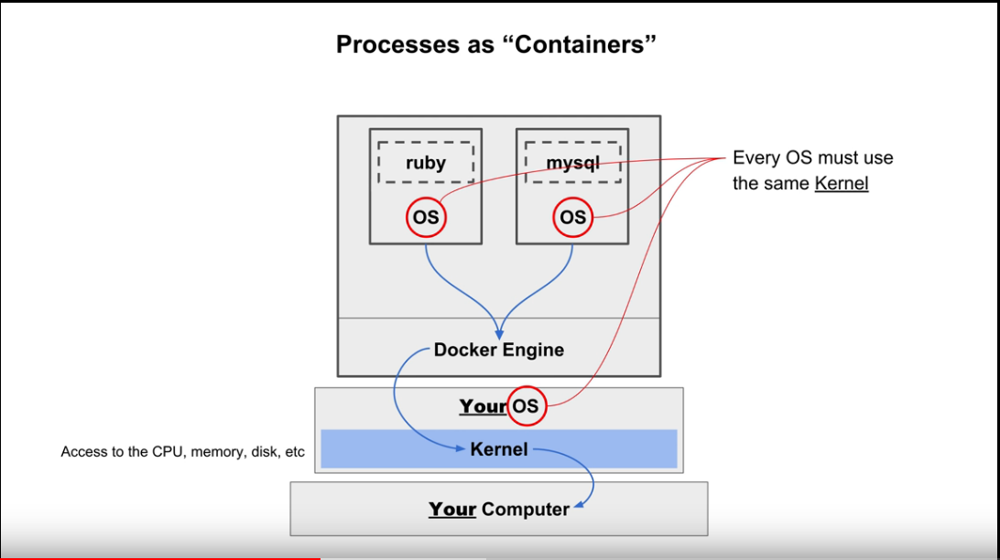

# What is Docker and Key concepts

>Notes and screenshots from: https://www.youtube.com/watch?v=T25Z4CUwYjE

All processes compete for the same CPU cycles, same memory and same disk. Docker is a solution to add process isolation.

It packages your application into one standardised unit, wrapping it into a complete file system that contains everything needed to run on a server.

### Processes as "Containers"

Instead of installing binaries (Node, MySQL, Ruby, etc) on your host OS, you install the Docker engine. You install those binaries inside the Docker engine instead.

When installed inside the Docker engine, we call them "containers".

Containers still run through your host OS kernel, which mediates access to CPU, RAM, disk. But they access the kernel through the Docker engine, which controls how much of each system resource they're able to use.

Docker can only access your host kernel - it cannot access anything else in the OS. This means that containers will need to package an OS inside them in order to run. Containers can have various different OSes. But all container OSes must use the same kernel - the container OS expects compatability with the host OS kernel.

So Linux OSes need to find a Linux kernel (Ubuntu, Debian, **Alpine**).

In addition to bundling an OS, containers also have to bundle all the dependencies your process requires (packages, libraries, etc).

### How Containers Are Built

For a regular, non-Docker-container process, we start with some source code, and compile it as an executable that gets run as a process inside my OS.

In Docker, we start with source code but also have to collect an OS and all the dependencies the code requires to run. Then we write a `Dockerfile`: a text file that instructs the Docker engine how to build our container.

Then we use the `docker build` command, which passes our `Dockerfile` to the Docker engine to build a Docker image. That image is then used to start our new container.

>If code needs to be compiled into an executable, there are 2 ways to do this:
>
>1. You can still compile it manually and specify it in Docker file.
>
>2. You can describe how to compile the executable inside the Dockerfile, and the Docker engine will compile your executable for you.

Then we use the `docker run` command to start the container. It may be one of many containers running on the Docker engine, each with process isolation from the others.

>Every time we run `docker build`, we don't replace an existing Docker image. Instead, a new Docker image is created. So Docker engine doesn't just manage running containers - it also acts as a repository for all the Docker images you have created.
>
>When we use `docker run` we specify a Docker image that's currently in our repository of images.

### What Makes Docker Special

Portability. Docker promises that containers will run in the same way on multiple, different host OSes. You just "drag and drop" the container.

This becomes extremely important when running in the cloud. Google Cloud Platform, Amazon AWS, and MS Azure all have warehouses of servers running various OSes. If you had to compile your code for each CPU and each OS, it would be nearly impossible. But with Docker and containerization, this becomes a non-issue: we can develop and test locally, and ship our container to the cloud with confidence that it will run the same way it runs locally.